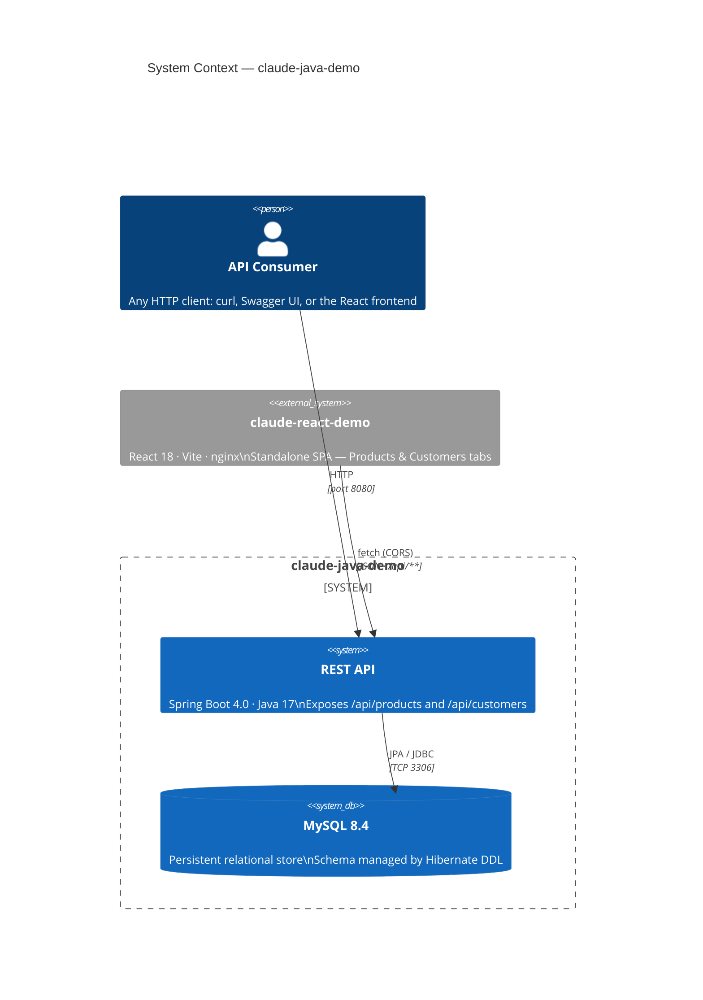

# claude-java-demo

Spring Boot REST API exploring hexagonal architecture patterns with Java.

**GitHub:** https://github.com/jsicree/claude-java-demo

## Stack

- **Java** 17
- **Spring Boot** 4.0.0
- **Build** Maven (`./mvnw`)
- **Packaging** Fat JAR
- **Database** MySQL 8.4 (production) · H2 (tests)
- **ORM** Spring Data JPA (Hibernate)
- **API Docs** OpenAPI/Swagger (`springdoc-openapi-starter-webmvc-ui` 3.0.1)

## Common commands

```bash
./mvnw spring-boot:run      # run the app (port 8080, requires MySQL)
./mvnw test                 # run tests (uses H2 in-memory)
./mvnw package              # build fat JAR → target/
```

## Docker

The preferred way to run the full stack (app + MySQL) is Docker Compose:

```bash
docker compose up -d          # start MySQL + app (builds image automatically)
docker compose down           # stop and remove containers
docker compose logs -f app    # tail app logs
```

Single-container commands (app only — requires an external MySQL):

```bash
docker build -t claude-java-demo .                    # two-stage: JDK build → JRE run
docker run -p 8080:8080 --name demo claude-java-demo  # run container on port 8080
docker stop demo                                      # stop by name
docker ps                                             # list running containers
```

## System context



## API endpoints

Swagger UI is available at **`http://localhost:8080/swagger-ui.html`** when the app is running.

| Method | Path | Description | Status |
|--------|------|-------------|--------|
| `POST` | `/api/products` | Create a product | 201 |
| `GET` | `/api/products` | List all products | 200 |
| `GET` | `/api/products/{id}` | Get product by UUID | 200 |
| `DELETE` | `/api/products/{id}` | Delete a product | 204 |
| `POST` | `/api/customers` | Register a customer | 201 |
| `GET` | `/api/customers` | List all customers | 200 |
| `GET` | `/api/customers/{id}` | Get customer by UUID | 200 |
| `DELETE` | `/api/customers/{id}` | Delete a customer | 204 |

## Architecture

Hexagonal (Ports & Adapters). Dependency rule: outer layers depend on inner layers, never the reverse.

```
domain      → (nothing)
application → domain
adapter     → application, domain
```

### Package layout

```
com.example.claudejavademo/
├── domain/
│   ├── model/           # entities, aggregates, value objects (no framework imports)
│   └── exception/       # domain-specific runtime exceptions
├── application/
│   ├── port/
│   │   ├── in/          # input port interfaces (use cases)
│   │   └── out/         # output port interfaces (repositories)
│   └── service/         # use-case implementations (package-private)
└── adapter/
    ├── in/
    │   └── web/         # REST controllers, request/response records
    └── out/
        └── persistence/ # JPA entities + repository implementations
```

### Conventions

- **Domain** classes have zero framework dependencies.
- **Use-case interfaces** live in `application.port.in`; one interface per use case.
- **Service classes** are package-private and implement one or more use-case interfaces.
- **Controllers and repositories** are package-private; Spring wires them via the port interfaces.
- **Request/Response models** are Java records scoped to `adapter.in.web` — the domain never sees HTTP shapes.
- **JPA entities** (`*JpaEntity`) live in `adapter.out.persistence` and are never exposed outside that package. Each adapter repository converts between JPA entities and domain objects.
- **Spring Data interfaces** (`SpringData*Repository`) are package-private helper interfaces extending `JpaRepository`; they are not the output ports.
- To swap persistence, implement the output port (e.g. `ProductRepository`) in a new `adapter.out.*` class without touching any other layer.
- **`GlobalExceptionHandler`** (`adapter.in.web`) maps domain exceptions to HTTP status codes (404 for NotFound, 409 for AlreadyExists).
- **`WebConfig`** (`adapter.in.web`) enables CORS on `/api/**` for cross-origin requests from the standalone React frontend (`claude-react-demo`).

### Javadoc

Every Java file must include:

1. **File-level Javadoc** placed before the `package` statement:
```java
/**
 * <One-sentence description of the class/interface/record.>
 *
 * @author Joe Sicree (test@test.com)
 * @since <YYYY-MM-DD of file creation>
 */
package com.example.claudejavademo...;
```

2. **Method-level Javadoc** on every explicit method (constructors, static factories, instance methods):
```java
/**
 * <One-sentence description of what the method does.>
 *
 * @param <name>  <description>
 * @return        <description of return value>
 * @throws <Type> <condition under which this is thrown>
 */
```
- Include `@param` for every parameter.
- Include `@return` for every non-void method.
- Include `@throws` for every checked or domain exception the method raises or propagates.
- Records with no explicit method bodies are exempt from method-level Javadoc.

## Current domains

| Domain | Entities | Input ports | Output ports | Domain exceptions |
|--------|----------|-------------|--------------|-------------------|
| Product | `Product` | `CreateProductUseCase`, `GetProductUseCase`, `DeleteProductUseCase` | `ProductRepository` | `ProductNotFoundException` |
| Customer | `Customer` | `RegisterCustomerUseCase`, `GetCustomerUseCase`, `DeleteCustomerUseCase` | `CustomerRepository` | `CustomerNotFoundException`, `CustomerAlreadyExistsException` |

## Persistence

JPA/MySQL via Spring Data. Each domain has:

| Class | Role |
|-------|------|
| `*JpaEntity` | `@Entity` mapped to a database table; implements `Persistable<String>` (UUID stored as `VARCHAR(36)`) |
| `SpringData*Repository` | Package-private `JpaRepository` extension used internally by the adapter |
| `Jpa*Repository` | `@Repository` implementing the application output port; owns entity↔domain conversions |

**Production — Docker Compose** (`src/main/resources/application.properties` overridden by `docker-compose.yml`):
- URL: `jdbc:mysql://mysql:3306/claudedemo` (uses the `mysql` Docker Compose service name)
- Credentials: `demo` / `demo`
- DDL: `hibernate.ddl-auto=update`

**Production — local (`./mvnw spring-boot:run`)**:
- URL: `jdbc:mysql://localhost:3306/claudedemo`
- Credentials: `demo` / `demo`

**Tests** (`src/test/resources/application.properties`):
- URL: `jdbc:h2:mem:testdb`
- DDL: `create-drop` (schema created fresh per test run)

## Domain model details

### Product
```java
// domain/model/Product.java
Product(UUID id, String name, BigDecimal price)          // full constructor
Product.create(String name, BigDecimal price)            // static factory (generates UUID)
product.updatePrice(BigDecimal newPrice)                 // validates non-negative
```

### Customer
```java
// domain/model/Customer.java
Customer(UUID id, String name, String email)             // full constructor
Customer.register(String name, String email)             // static factory (generates UUID)
```

## Adding a new domain (checklist)

1. **Domain model** — add entity class to `domain/model/` (no framework imports).
2. **Domain exceptions** — add to `domain/exception/` extending `RuntimeException`.
3. **Input ports** — add use-case interfaces to `application/port/in/` (create, get, delete, etc.).
4. **Output port** — add repository interface to `application/port/out/`.
5. **Service** — add package-private `@Service` class to `application/service/` implementing the input ports.
6. **JPA entity** — add `*JpaEntity` class to `adapter/out/persistence/`.
7. **Spring Data interface** — add package-private `SpringData*Repository extends JpaRepository` in the same package.
8. **JPA repository adapter** — add `@Repository` class implementing the output port.
9. **Controller** — add package-private `@RestController` to `adapter/in/web/`.
10. **Request/Response records** — add to `adapter/in/web/`.

## Frontend

The companion SPA is **claude-react-demo** (React 18 · Vite · nginx). It runs on port 3000 and proxies `/api/**` requests to this service on port 8080. Start this backend first before running the frontend. See its `CLAUDE.md` for startup instructions.
