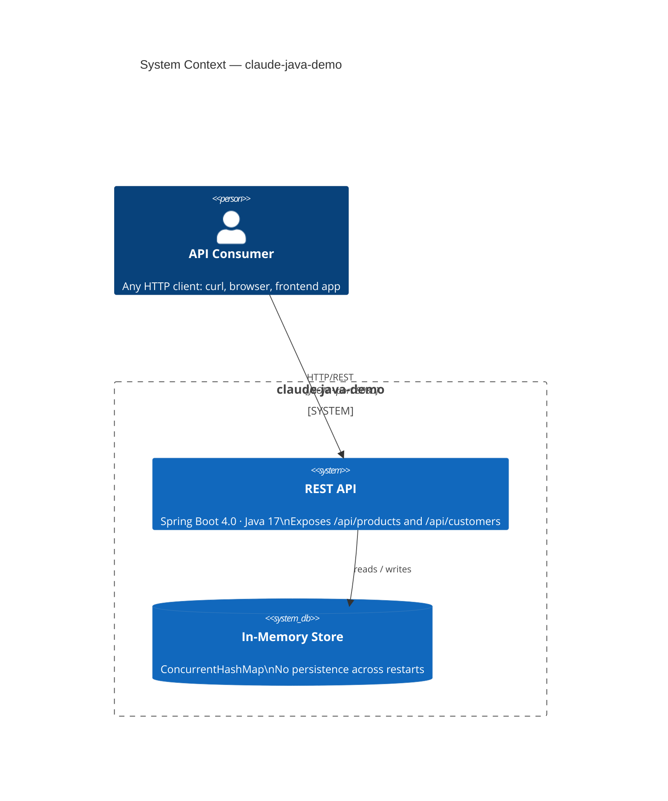

# claude-java-demo

Spring Boot demo project exploring hexagonal architecture patterns with Java.

**GitHub:** https://github.com/jsicree/claude-java-demo

## Stack

- **Java** 17
- **Spring Boot** 4.0.0
- **Build** Maven (`./mvnw`)
- **Packaging** JAR

## Common commands

```bash
./mvnw spring-boot:run      # run the app (port 8080 by default)
./mvnw test                 # run tests
./mvnw package              # build fat JAR → target/
```

## Docker

```bash
docker build -t claude-java-demo .                    # build image (two-stage: JDK build → JRE run)
docker run -p 8080:8080 --name demo claude-java-demo  # run container on port 8080
docker stop demo                                      # stop by name
docker ps                                             # find container ID if no name given
```

## System context



## Architecture

Hexagonal (Ports & Adapters). Dependency rule: outer layers depend on inner layers, never the reverse.

```
domain → (nothing)
application → domain
adapter → application, domain
```

### Package layout

```
com.example.claudejavademo/
├── domain/
│   ├── model/          # entities, aggregates, value objects
│   └── exception/      # domain-specific exceptions
├── application/
│   ├── port/
│   │   ├── in/         # input port interfaces (use cases)
│   │   └── out/        # output port interfaces (repositories, clients)
│   └── service/        # use-case implementations (package-private classes)
└── adapter/
    ├── in/
    │   └── web/        # REST controllers, request/response records
    └── out/
        └── persistence/ # repository implementations
```

### Conventions

- **Domain** classes have zero framework dependencies.
- **Use-case interfaces** live in `application.port.in`; one interface per use case.
- **Service classes** are package-private and implement one or more use-case interfaces.
- **Controllers and repositories** are package-private; Spring wires them via the port interfaces.
- **Request/Response models** are Java records, scoped to `adapter.in.web` — the domain never sees HTTP shapes.
- To swap persistence, implement `ProductRepository` (output port) in a new `adapter.out.*` class without touching any other layer.

## Current domains

| Domain | Entities | Input ports | Output ports |
|--------|----------|-------------|--------------|
| Product | `Product` | `CreateProductUseCase`, `GetProductUseCase` | `ProductRepository` |
| Customer | `Customer` | `RegisterCustomerUseCase`, `GetCustomerUseCase` | `CustomerRepository` |

## Persistence

Currently in-memory (`InMemoryProductRepository`, `InMemoryCustomerRepository`). No database configured yet.